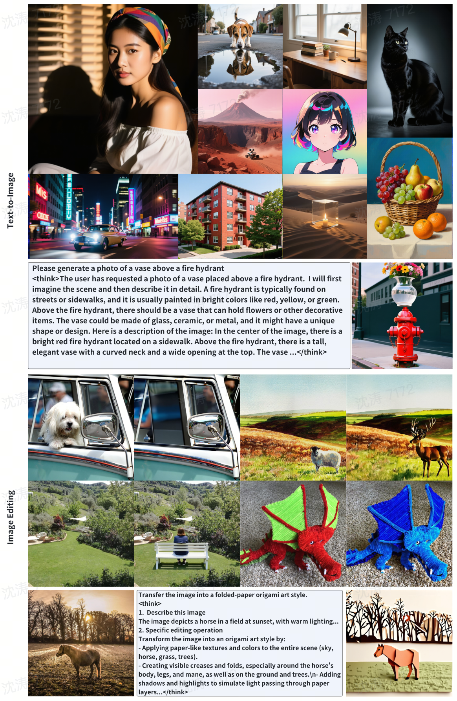

<div align="center">


# MammothModa2: Jointly Optimized Autoregressive-Diffusion Models for Unified Multimodal Understanding and Generation


[](https://github.com/bytedance/mammothmoda)
[](https://ali-vilab.github.io/MammothModa-Page/)
[](https://huggingface.co/bytedance-research/MammothModa2-Preview)

</div>


## Introduction

MammothModa2 is a unified Autoregressive-Diffusion (AR-Diffusion) framework designed for comprehensive multimodal understanding and generation. The model adopts a novel serial architecture: the AR backbone utilizes MammothTok—a unified, language-aligned visual tokenizer—to execute complex semantic planning, which then conditions a high-fidelity Diffusion Decoder. Our core technical contribution is a unified joint training strategy, pioneering the simultaneous optimization of the discrete Next-Token Prediction (NTP) loss and the continuous Flow Matching loss within a serial AR-Diffusion system. This end-to-end alignment between the planning and generation spaces enables MammothModa to achieve competitive performance across complex text-to-image generation, editing, and visual understanding benchmarks.

## Show cases
<!-- <div align="center">
  
</div> -->

<div align="center">
  
</div>

## 🎉 News
- [x] 2025-10-01: 🔥MammothModa2-Preview models are now available at [HuggingFace](https://huggingface.co/bytedance-research/MammothModa2-Preview)


## 🪄 Models
| Model | Download Link | License |
|-------|---------------|----------|
| MammothModa2-Preview | [🤗 HuggingFace](https://huggingface.co/bytedance-research/MammothModa2-Preview) | [Apache-2.0](https://opensource.org/licenses/Apache-2.0) |

## ⚙️ Installation

The codebase has been tested with Python 3.11.9, CUDA 12.4, and PyTorch 2.6.0. You can set up the environment using uv with the following command:

```bash
# Clone the repository
git clone https://github.com/bytedance/mammothmoda.git
cd mammothmoda

# Install dependencies
uv sync --frozen
```

## 🚀 Usage

### Text-to-Image Generation

```python
import torch
from qwen_vl_utils import process_vision_info
from transformers import AutoProcessor
from mammothmoda2.model import DEFAULT_NEGATIVE_PROMPT, Mammothmoda2Model
from mammothmoda2.utils import decode_diffusion_image

# Mammothmoda2 model and processor loading.
model = Mammothmoda2Model.from_pretrained(
    "bytedance-research/MammothModa2-Preview",
    attn_implementation="flash_attention_2",
    torch_dtype="bfloat16",
    t2i_generate=True,
).to("cuda")
processor = AutoProcessor.from_pretrained(
    "bytedance-research/MammothModa2-Preview",
    t2i_generate=True,
    ar_height=32,
    ar_width=32,
)

# Mammothmoda2 inputs preprocessing.
messages = [
    {
        "role": "user",
        "content": [
            {
                "type": "text",
                "text": "这张图片展示了一座现代化城市的美丽景象。画面中最显眼的是一座高耸入云的摩天大楼，其外立面在夕阳余晖的映照下显得格外醒目。周围环绕着多栋风格各异的高楼大厦，这些大楼的窗户透出点点灯光，显示出城市的繁华。左侧有一座带有绿色圆顶的建筑，造型独特。在建筑物前方的水面上，有几艘白色的帆船正在航行，给城市增添了一份灵动的气息。天空呈现出浪漫的粉色，可能是日出或日落时分，整个画面色彩柔和，充满了宁静与美好的氛围。",
            },
        ],
    }
]
text = processor.apply_chat_template(messages, tokenize=False, add_generation_prompt=True)
image_inputs, video_inputs = process_vision_info(messages)
inputs = processor(
    text=[text],
    images=image_inputs,
    videos=video_inputs,
    num_images_per_prompt=4,
    cfg_scale=7.0,
    negative_prompt=DEFAULT_NEGATIVE_PROMPT,
    padding=True,
    padding_side="left",
    return_tensors="pt",
    return_token_type_ids=False,  # Or generate would raise error.
).to("cuda")

# Mammothmoda2 t2i generate.
with torch.inference_mode(), torch.autocast(device_type="cuda", dtype=torch.bfloat16):
    generated_ids, attention_mask = model.generate(**inputs)
    diff_return_info = decode_diffusion_image(
        input_ids=inputs.input_ids,
        generated_ids=generated_ids,
        attention_mask=attention_mask,
        negative_ids=inputs.get("negative_ids", None),
        negative_mask=inputs.get("negative_mask", None),
        model=model,
        tokenizer=processor.tokenizer,
        output_dir="./mammothmoda2_t2i_release",
        num_images_per_prompt=4,
        text_guidance_scale=9.0,
        vae_scale_factor=16,
        cfg_range=(0.0, 1.0),
        num_inference_steps=50,
        height=1024,
        width=1024,
    )
```

### Multi-modal Understanding

```python
import torch
from qwen_vl_utils import process_vision_info
from transformers import AutoProcessor
from mammothmoda2.model import Mammothmoda2Model

# Mammothmoda2 model and processor loading.
model = Mammothmoda2Model.from_pretrained(
    "bytedance-research/MammothModa2-Preview",
    attn_implementation="flash_attention_2",
    torch_dtype="bfloat16",
).to("cuda")
print(f"model.device={model.device}")
processor = AutoProcessor.from_pretrained("bytedance-research/MammothModa2-Preview")

# Mammothmoda2 inputs preprocessing.
messages = [
    {
        "role": "user",
        "content": [
            {
                "type": "image",
                "image": "doc/example0.png",
            },
            {"type": "text", "text": "这个场景中，根据这位男士的面部表情和身体语言，我们能推断出他的情绪状态吗？"},
        ],
    }
]
text = processor.apply_chat_template(messages, tokenize=False, add_generation_prompt=True)
image_inputs, video_inputs = process_vision_info(messages)
inputs = processor(
    text=[text],
    images=image_inputs,
    videos=video_inputs,
    padding=True,
    padding_side="left",
    return_tensors="pt",
    return_token_type_ids=False,
).to("cuda")

# Mammothmoda2 model generation and decoding.
with torch.inference_mode(), torch.autocast(dtype=torch.bfloat16):
    generated_ids = model.generate(**inputs)
generated_ids_trimmed = [out_ids[len(in_ids) :] for in_ids, out_ids in zip(inputs.input_ids, generated_ids)]
output_texts = processor.batch_decode(
    generated_ids_trimmed, skip_special_tokens=True, clean_up_tokenization_spaces=False
)
print(output_texts)
```

## 📊 Benchmark Results

| Model | Model Size | GenEval | DPGBench |
|-------|------------|---------|----------|
| **Generation** |
| SDXL | - | 0.55 | 74.65 |
| DALL-E 3 | - | 0.67 | 83.50 |
| FLUX.1-dev | - | 0.67 | 84.00 |
| SD3.5-Medium* | - | 0.65 | 83.86 |
| **Unified** |
| Emu3 | 8B | 0.66 | 80.60 |
| Janus-Pro | 7B | 0.80 | 84.19 |
| MetaQuery-XL | 7B + 1.6B | 0.80 | 82.05 |
| UniWorld-V1 | 7B + 12B | 0.84 | 81.38 |
| Blip3-o-8B | 7B + 1.4B | 0.84 | 81.60 |
| OmniGen2 | 3B + 4B | 0.86 | 83.57 |
| Ovis-U1 | 2.4B + 1.2B | 0.89 | 83.72 |
| UniPic2 | 7B + 2B | 0.90 | 83.79 |
| BAGEL | 7B + 7B | 0.88 | 85.07 |
| Show-o2 | 7B | 0.76 | 86.14 |
| GPT-4o | - | 0.84 | 86.23 |
| MammothModa2-Preview | 7B + (3B + 2B) | 0.85 | 87.1 |

**Note**: Model sizes in "A + B" format indicate separate understanding (A) and generation (B) parameters. Models without "+" share parameters for both tasks. MammothModa2-Preview uses a 7B + (3B + 2B) architecture, where the 7B parameters are for understanding, and the generation part consists of 3B parameters in the AR (MLLM backbone) and 2B parameters in the DiT component.


## Acknowledgement

We are grateful to the following open-source projects:

- [OmniGen2](https://github.com/VectorSpaceLab/OmniGen2)
- [Qwen3-VL](https://github.com/QwenLM/Qwen3-VL)


## Citation

If you find MammothModa2 useful in your research, please cite:

```bibtex
@article{shen2025mammothmoda2,
    title={MammothModa2: A Unified AR-Diffusion Framework for Multimodal Understanding and Generation},
    author={Shen, Tao and Wan, Xin and Chen, Taicai and Zhang, Rui and Pan, Junwen and Lu, Dawei and Lei, Fanding and Lu, Zhilin and Yang, Yunfei and Cheng, Chen and She, Qi and Liu, Chang and Sun, Zhenbang},
    journal={arXiv preprint arXiv:2511.18262},
    year={2025},
    url={https://arxiv.org/abs/2511.18262}
}
```
