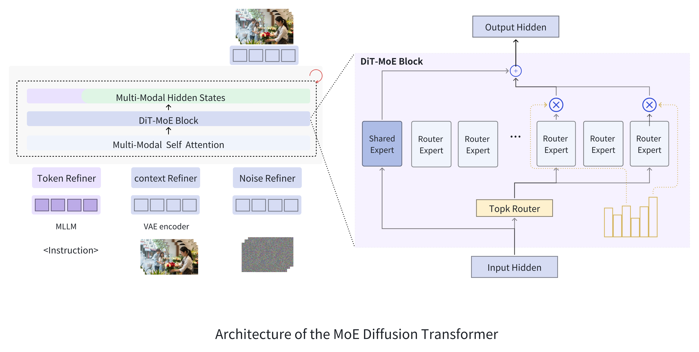
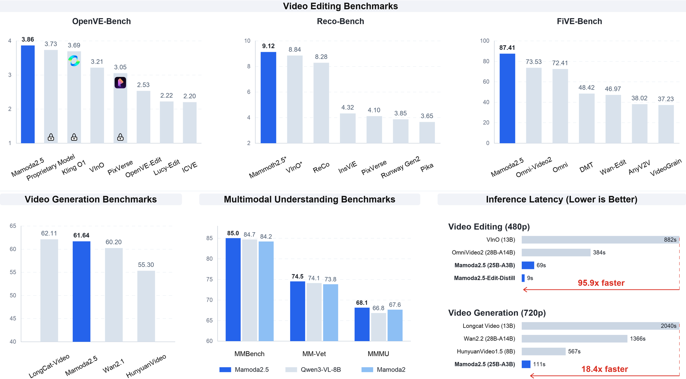
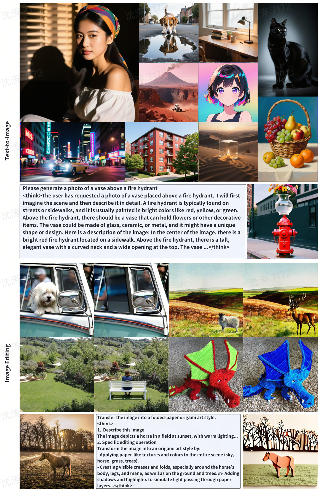

<div align="center">


# MammothModa2: A Unified AR-Diffusion Framework for Visual Understanding and Generation

<p align="center">
  🌐 <a href="https://mammothmoda2.github.io/"><b>Homepage</b></a> &nbsp;&nbsp;|&nbsp;&nbsp; 📑 <a href="https://arxiv.org/abs/2511.18262">Technical Report</a>
  <br>
</p>

</div>

## Introduction

MammothModa2 (Mammoth2) is a unified autoregressive-diffusion (AR-Diffusion) framework that seamlessly integrates multimodal understanding and generation within a single model. Mammoth2 effectively couples autoregressive semantic planning with a **Mixture-of-Experts (MoE) diffusion-based generation** backbone, enabling high-quality text-to-image generation, **text-to-video generation**, instruction-based editing, and comprehensive multimodal understanding.

<p align="center">
  
</p>

<div align="center">
  <hr width="750" size="1" color="#e5e7eb" />
</div>

<p align="center">
  
</p>

**Key Features:**
- **MoE DiT for Video Generation at Scale** MammothModa2 integrates a **Mixture-of-Experts (MoE)** architecture into the **Video Generation** pipeline to address the compute bottlenecks that emerge when scaling video models. MammothModa includes two MoE variants: 20B-A3B (E48A6) and 6B-A1.2B (E32A4). Despite having ~40% more total parameters than WanVideo 14B, the 20B model activates only ~20% of parameters at inference, achieving up to **15.1×** faster generation.
- **Unified Multimodal Design** A single AR-diffusion framework built on Qwen3VL for multimodal understanding and an MoE DiT backbone for generation, supporting text-to-image, image editing, and text-to-video generation with shared representations and training recipes.
- **🚀 Superior Efficiency**: Mammoth25 (20B-A3B) delivers 11–15× lower video latency than state-of-the-art video generators (e.g., LongCat-Video), while achieving strong quality on VBench2.0 with a 60.97% total score, outperforming Wan2.1-14B and HunyuanVideo1.0-13B and approaching LongCat-Video-14B.

## 🎉 News
- 2025-12-31: 🔥Released **MammothModa2** with **MoE DiT** architecture, now supporting **Video Generation**! Check out our new [Project Page](https://mammothmoda2.github.io/). Code is available at [MammothModa25](https://github.com/bytedance/mammothmoda/tree/main/mammothmoda25).
- 2025-12-10: 🔥MammothModa2-Dev build upon Qwen3VL-8B supports Image Editing are now available at [HuggingFace](https://huggingface.co/bytedance-research/MammothModa2-Dev). 
- 2025-10-01: 🔥MammothModa2-Preview models are now available at [HuggingFace](https://huggingface.co/bytedance-research/MammothModa2-Preview). **Note: To use the Preview version, please switch to the `qwen25vl` branch.**

## Showcases

### Text-to-Video Generation & Video Editing (Coming Soon)

MammothModa2 supports high-quality text-to-video generation. 

<table>
  <tr>
    <td width="50%">
      <div align="center">
        <video src="https://github.com/user-attachments/assets/0b5d403b-0565-4c82-a4d4-bce0631f203b" controls="controls" width="100%">
        </video>
        <br>
        <b>Cinematic Shots</b>
      </div>
      <details>
        <summary>Prompt</summary>
        "俯视角度，一位有着深色，略带凌乱的长卷发的年轻中国女性，佩戴着闪耀的珍珠项链和圆形金色耳环，她凌乱的头发被风吹散，她微微抬头，望向天空，神情十分哀伤，眼中含着泪水。嘴唇涂着红色口红。背景是带有华丽红色花纹的图案。画面呈现复古电影风格，色调低饱和，带着轻微柔焦，烘托情绪氛围，质感仿佛20世纪90年代的经典胶片风格，营造出怀旧且富有戏剧性的感觉。"
      </details>
    </td>
    <td width="50%">
      <div align="center">
        <video src="https://github.com/user-attachments/assets/486bf448-c612-4b1b-953e-9493855df5b4" controls="controls" width="100%">
        </video>
        <br>
        <b>Animal Interaction</b>
      </div>
      <details>
        <summary>Prompt</summary>
        "A medium shot of a chameleon carefully crawling along a tree branch, its feet gripping tightly to the bark. The camera captures the slow, deliberate movements, the slight shifting of colors, and the independent movement of its eyes."
      </details>
    </td>
  </tr>
  <tr>
    <td width="50%">
      <div align="center">
        <video src="https://github.com/user-attachments/assets/a5e91bb6-e595-41ac-89b5-f77cf639115e" controls="controls" width="100%">
        </video>
        <br>
        <b>Motion</b>
      </div>
      <details>
        <summary>Prompt</summary>
        "A man wearing a black leather jacket and sunglasses rides a motorcycle down a winding mountain road, the road is carved into the mountainside, the scenery is breathtaking with steep cliffs and deep valleys, the sky is clear and blue, the camera follows the motorcycle from behind, capturing the speed and freedom of the ride, the motorcycle is sleek and black, the man's jacket flutters in the wind, the scene is exhilarating and cinematic. 
        "
      </details>
    </td>
    <td width="50%">
      <div align="center">
        <video src="https://github.com/user-attachments/assets/4f855139-4d1e-4a66-b939-982cfa485648" controls="controls" width="100%">
        </video>
        <br>
        <b>Scenery</b>
      </div>
      <details>
        <summary>Prompt</summary>
        "A man wearing a green raincoat and boots walks through a dense forest in the rain, the trees are tall and create a canopy overhead, the rain is visible as it falls through the trees, the ground is covered in fallen leaves, the scene is moody and atmospheric, captured with a handheld camera, the man is slightly hunched, protecting himself from the rain, the forest is dark and mysterious, the rain creates a peaceful ambiance."
      </details>
    </td>
  </tr>
  <tr>
    <td width="50%">
      <div align="center">
        <video src="https://github.com/user-attachments/assets/7d7b2da8-0774-40b4-80c7-4c5fd78a2320" controls="controls" width="100%">
        </video>
        <br>
        <b>High-Speed Motion</b>
      </div>
      <details>
        <summary>Prompt</summary>
        "In a magical, floating island world, a young adventurer with a jetpack soars through the sky, dodging floating rocks and mystical creatures. The camera follows the adventurer from behind, offering a sweeping view of the vast, interconnected islands, each with its unique terrain and ecosystem. The animation features fluid, high-speed flying sequences, with the adventurer narrowly avoiding obstacles and discovering hidden treasure."
      </details>
    </td>
    <td width="50%">
       <div align="center">
        <a href="https://mammothmoda2.github.io/">View More on Project Page</a>
      </div>
    </td>
  </tr>
</table>

### Text-to-Image & Image Editing

<div align="center">
  
</div>


## 🪄 Models
| Model | Download Link | Arch |Description|
|-------|---------------|-------------|-------------|
| MammothModa2_5-6B-A1.2B| [Coming Soon] |Qwen3VL + 6B-A1.2B MoE DiT | 🔥 Supporting Video Generation. |
| MammothModa2_5-20B-A3B| [Coming Soon] |Qwen3VL + 20B-A3B MoE DiT | 🔥 Supporting Video Generation. |
| MammothModa2-Dev | [🤗 HuggingFace](https://huggingface.co/bytedance-research/MammothModa2-Dev) | Qwen3VL-8B + 3B gen experts + 2B dense DiT | Image Generation & Editing|
| MammothModa2-Preview | [🤗 HuggingFace](https://huggingface.co/bytedance-research/MammothModa2-Preview) | Qwen25VL-7B + 3B gen experts + 2B dense DiT| Image Generation. Note: Please switch to the `qwen25vl` branch. |

## ⚙️ Installation

The codebase has been tested with Python 3.11.9, CUDA 12.4, and PyTorch 2.6.0. You can set up the environment using uv with the following command:

```bash
# Clone the repository
git clone https://github.com/bytedance/mammothmoda.git
cd mammothmoda

# Install dependencies
uv sync --frozen
```

## 🚀 Usage

### Text-to-Image Generation

```python
import torch
from qwen_vl_utils import process_vision_info
from transformers import AutoProcessor
from mammothmoda2.model import DEFAULT_NEGATIVE_PROMPT, Mammothmoda2Model
from mammothmoda2.utils import decode_diffusion_image

# Mammothmoda2 model and processor loading.
model = Mammothmoda2Model.from_pretrained(
    "bytedance-research/MammothModa2-Preview",
    attn_implementation="flash_attention_2",
    torch_dtype="bfloat16",
    t2i_generate=True,
).to("cuda")
processor = AutoProcessor.from_pretrained(
    "bytedance-research/MammothModa2-Preview",
    t2i_generate=True,
    ar_height=32,
    ar_width=32,
)

# Mammothmoda2 inputs preprocessing.
messages = [
    {
        "role": "user",
        "content": [
            {
                "type": "text",
                "text": "这张图片展示了一座现代化城市的美丽景象。画面中最显眼的是一座高耸入云的摩天大楼，其外立面在夕阳余晖的映照下显得格外醒目。周围环绕着多栋风格各异的高楼大厦，这些大楼的窗户透出点点灯光，显示出城市的繁华。左侧有一座带有绿色圆顶的建筑，造型独特。在建筑物前方的水面上，有几艘白色的帆船正在航行，给城市增添了一份灵动的气息。天空呈现出浪漫的粉色，可能是日出或日落时分，整个画面色彩柔和，充满了宁静与美好的氛围。",
            },
        ],
    }
]
text = processor.apply_chat_template(messages, tokenize=False, add_generation_prompt=True)
image_inputs, video_inputs = process_vision_info(messages)
inputs = processor(
    text=[text],
    images=image_inputs,
    videos=video_inputs,
    num_images_per_prompt=4,
    cfg_scale=7.0,
    negative_prompt=DEFAULT_NEGATIVE_PROMPT,
    padding=True,
    padding_side="left",
    return_tensors="pt",
    return_token_type_ids=False,  # Or generate would raise error.
).to("cuda")

# Mammothmoda2 t2i generate.
with torch.inference_mode(), torch.autocast(device_type="cuda", dtype=torch.bfloat16):
    generated_ids, attention_mask = model.generate(**inputs)
    diff_return_info = decode_diffusion_image(
        input_ids=inputs.input_ids,
        generated_ids=generated_ids,
        attention_mask=attention_mask,
        negative_ids=inputs.get("negative_ids", None),
        negative_mask=inputs.get("negative_mask", None),
        model=model,
        tokenizer=processor.tokenizer,
        output_dir="./mammothmoda2_t2i_release",
        num_images_per_prompt=4,
        text_guidance_scale=9.0,
        vae_scale_factor=16,
        cfg_range=(0.0, 1.0),
        num_inference_steps=50,
        height=1024,
        width=1024,
    )
```

### Multi-modal Understanding

```python
import torch
from qwen_vl_utils import process_vision_info
from transformers import AutoProcessor
from mammothmoda2.model import Mammothmoda2Model

# Mammothmoda2 model and processor loading.
model = Mammothmoda2Model.from_pretrained(
    "bytedance-research/MammothModa2-Preview",
    attn_implementation="flash_attention_2",
    torch_dtype="bfloat16",
).to("cuda")
print(f"model.device={model.device}")
processor = AutoProcessor.from_pretrained("bytedance-research/MammothModa2-Preview")

# Mammothmoda2 inputs preprocessing.
messages = [
    {
        "role": "user",
        "content": [
            {
                "type": "image",
                "image": "doc/example0.png",
            },
            {"type": "text", "text": "这个场景中，根据这位男士的面部表情和身体语言，我们能推断出他的情绪状态吗？"},
        ],
    }
]
text = processor.apply_chat_template(messages, tokenize=False, add_generation_prompt=True)
image_inputs, video_inputs = process_vision_info(messages)
inputs = processor(
    text=[text],
    images=image_inputs,
    videos=video_inputs,
    padding=True,
    padding_side="left",
    return_tensors="pt",
    return_token_type_ids=False,
).to("cuda")

# Mammothmoda2 model generation and decoding.
with torch.inference_mode(), torch.autocast(dtype=torch.bfloat16):
    generated_ids = model.generate(**inputs)
generated_ids_trimmed = [out_ids[len(in_ids) :] for in_ids, out_ids in zip(inputs.input_ids, generated_ids)]
output_texts = processor.batch_decode(
    generated_ids_trimmed, skip_special_tokens=True, clean_up_tokenization_spaces=False
)
print(output_texts)
```

## 📊 Benchmark Results

### Text-to-Image

| Model | Model Size | GenEval | DPGBench |
|-------|------------|---------|----------|
| **Generation** |
| SDXL | - | 0.55 | 74.65 |
| DALL-E 3 | - | 0.67 | 83.50 |
| FLUX.1-dev | - | 0.67 | 84.00 |
| SD3.5-Medium* | - | 0.65 | 83.86 |
| **Unified** |
| Emu3 | 8B | 0.66 | 80.60 |
| Janus-Pro | 7B | 0.80 | 84.19 |
| MetaQuery-XL | 7B + 1.6B | 0.80 | 82.05 |
| UniWorld-V1 | 7B + 12B | 0.84 | 81.38 |
| Blip3-o-8B | 7B + 1.4B | 0.84 | 81.60 |
| OmniGen2 | 3B + 4B | 0.86 | 83.57 |
| Ovis-U1 | 2.4B + 1.2B | 0.89 | 83.72 |
| UniPic2 | 7B + 2B | 0.90 | 83.79 |
| BAGEL | 7B + 7B | 0.88 | 85.07 |
| Show-o2 | 7B | 0.76 | 86.14 |
| GPT-4o | - | 0.84 | 86.23 |
| MammothModa2 | 8B + (3B + 2B) | 0.87 | 87.2 |

**Note**: Model sizes in "A + B" format indicate separate understanding (A) and generation (B) parameters. Models without "+" share parameters for both tasks. MammothModa2 uses a 8B + (3B + 2B) architecture, where the 8B parameters are for understanding, and the generation part consists of 3B parameters in the AR (MLLM backbone) and 2B parameters in the DiT component.

### Text-to-Video

Coming soon.

### Image Editing

Coming soon.

### Video Editing

Coming soon.


## Acknowledgement

We are grateful to the following open-source projects:

- [OmniGen2](https://github.com/VectorSpaceLab/OmniGen2)
- [Qwen3-VL](https://github.com/QwenLM/Qwen3-VL)


## Citation

If you find MammothModa2 useful in your research, please cite:

```bibtex
@article{shen2025mammothmoda2,
    title={MammothModa2: A Unified AR-Diffusion Framework for Multimodal Understanding and Generation},
    author={Shen, Tao and Wan, Xin and Chen, Taicai and Zhang, Rui and Pan, Junwen and Lu, Dawei and Lei, Fanding and Lu, Zhilin and Yang, Yunfei and Cheng, Chen and She, Qi and Liu, Chang and Sun, Zhenbang},
    journal={arXiv preprint arXiv:2511.18262},
    year={2025},
    url={https://arxiv.org/abs/2511.18262}
}
```

## 🎯 Join Our Team

**Moderation LLM Team @ ByteDance** - We're hiring talented individuals passionate about multimodal AI, computer vision, and MLLM development! 

We develop leading MLLMs for content moderation, building infrastructure including model benchmarking, data pipelines, efficient architectures, and training methodologies.

**Recent Publications (2024–2026):**
- Pan, J., Zhang, Q., Zhang, R., Lu, M., Wan, X., Zhang, Y., Liu, C., & She, Q. (2025). TimeSearch-R: Adaptive Temporal Search for Long-Form Video Understanding via Self-Verification Reinforcement Learning. ICLR 26.
- Li, Y., Wang, Y., Zhu, Y., Zhao, Z., Lu, M., She, Q., & Zhang, S. (2025). BranchGRPO: Stable and Efficient GRPO with Structured Branching in Diffusion Models. ICLR 26.
- Li, Z., Qian, D., Su, K., Diao, Q., Xia, X., Liu, C., ... & Yuan, Z. (2025). Bindweave: Subject-consistent video generation via cross-modal integration. ICLR 26.
- Zhang, Q., Cheng, A., Lu, M., Zhuo, Z., Wang, M., Cao, J., Guo, S., She, Q., & Zhang, S. Beyond Text-Visual Attention: Exploiting Visual Cues for Effective Token Pruning in VLMs. ICCV 25.
- Xie, R., Du, C., Song, P., & Liu, C. (2025). Muse-vl: Modeling unified vlm through semantic discrete encoding. ICCV 25.
- Zhang, Q., Liu, M., Li, L., Lu, M., Zhang, Y., Pan, J., She, Q., & Zhang, S. (2025). Beyond Attention or Similarity: Maximizing Conditional Diversity for Token Pruning in MLLMs. NeurIPS 25.
- Lin, L., Shi, D., Han, A., Chen, F., Chen, Q., Li, J., ... & Gao, J. (2025). ACT as human: Multimodal large language model data annotation with critical thinking. NeurIPS 25.
- Yu, S., Jin, C., Wang, H., Chen, Z., Jin, S., Zuo, Z., ... & Sun, Q. (2024). Frame-voyager: Learning to query frames for video large language models. ICLR 25.
- Pan, J., Zhang, R., Wan, X., Zhang, Y., Lu, M., & She, Q. (2025). Timesearch: Hierarchical video search with spotlight and reflection for human-like long video understanding. arXiv Preprint arXiv:2504.01407.
- Liu, Z., Pan, J., She, Q., Gao, Y., & Xia, G. (2025). On the Faithfulness of Visual Thinking: Measurement and Enhancement. arXiv Preprint arXiv:2510.23482.
- Zhang, Y., Fan, C.-K., Huang, T., Lu, M., Yu, S., Pan, J., Cheng, K., She, Q., & Zhang, S. (2025). AutoV: Learning to Retrieve Visual Prompt for Large Vision-Language Models. arXiv Preprint arXiv:2506.16112.
- Yuan Zhang, Ming Lu, Junwen Pan, Tao Huang, Kuan Cheng, Chang Liu, Qi She, Shanghang Zhang(2025). ChainV: Atomic Visual Hints Make Multimodal Reasoning Shorter and Better. arXiv Preprint arXiv:2511.17106.
- Shi, H., Liang, J., Xie, R., Wu, X., Chen, C., & Liu, C. (2025). Aquarius: A Family of Industry-Level Video Generation Models for Marketing Scenarios. arXiv preprint arXiv:2505.10584.
- Shen, T., Wan, X., Chen, T., Zhang, R., Pan, J., Lu, D., Lei, F., Lu, Z., Yang, Y., & Cheng, C. (2025). MammothModa2: A Unified AR-Diffusion Framework for Multimodal Understanding and Generation. arXiv Preprint arXiv:2511.18262.
- Qi She, Junwen Pan, Xin Wan, Rui Zhang, Dawei Lu, Kai Huang. (2024). MammothModa: Multi-Modal Large Language Model. arXiv.

**Contact:**  liuchang.lab@bytedance.com
